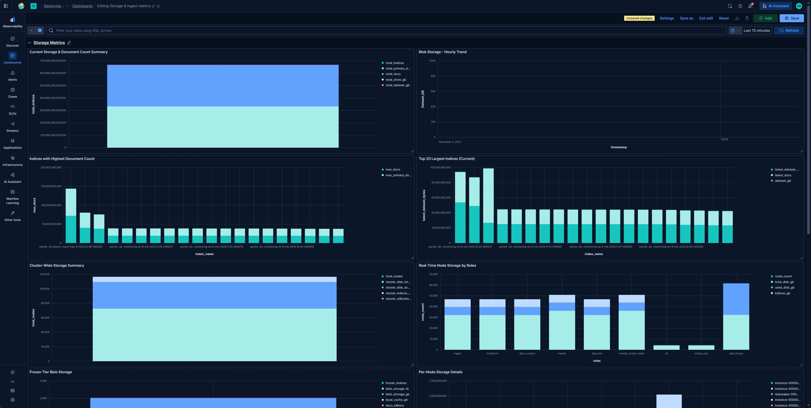

## 🤖 Assistant

Here is the `README.md` file tailored to your specific requirements and the attached files.

***

# Frozen Storage & Ingest Metrics Dashboard

This project provides a comprehensive monitoring solution for Elasticsearch 9.x clusters, focusing specifically on **Frozen Tier** storage usage (searchable snapshots) and real-time ingest metrics. 

It utilizes an **Elasticsearch Transform** to aggregate historical storage data and a **Kibana Dashboard** powered by ES|QL to visualize the results.



## Prerequisites

Before deploying this dashboard, ensure the following requirements are met:

1.  **Elastic Stack Version**: 9.x
2.  **Stack Monitoring**: You must have **Elastic Stack Monitoring** enabled and collecting data. The dashboard relies on the internal monitoring indices (specifically `.ds-.monitoring-es-8-mb-*`).
3.  **Permissions**: The user deploying this must have permissions to:
    *   Create and start Transforms (`manage_transform`).
    *   Import Saved Objects in Kibana.
    *   Read monitoring indices.

## Installation Guide

Follow these steps in order to set up the monitoring components.

### Step 1: Create the Transform

The dashboard relies on a transform to calculate and store historical data regarding frozen tier indices (specifically `partial-*` indices).

1.  Open **Kibana**.
2.  Navigate to **Dev Tools** (Console).
3.  Copy and paste the following code (from `transform.txt`) and execute it:

```json
PUT _transform/storage-metrics-frozen-tier
{
  "source": {
    "index": [
      ".ds-.monitoring-es-8-mb-*",
      ".ds-.monitoring-es-9-mb-*" 
    ],
    "query": {
      "bool": {
        "must": [
          {
            "term": {
              "event.dataset": "elasticsearch.index"
            }
          },
          {
            "wildcard": {
              "elasticsearch.index.name": "partial-*"
            }
          }
        ]
      }
    }
  },
  "dest": {
    "index": "storage-metrics-frozen-tier"
  },
  "frequency": "1h",
  "sync": {
    "time": {
      "field": "@timestamp",
      "delay": "60s"
    }
  },
  "pivot": {
    "group_by": {
      "timestamp": {
        "date_histogram": {
          "field": "@timestamp",
          "fixed_interval": "1h"
        }
      },
      "index_name": {
        "terms": {
          "field": "elasticsearch.index.name"
        }
      }
    },
    "aggregations": {
      "total_store_bytes": {
        "max": {
          "field": "elasticsearch.index.total.store.size_in_bytes"
        }
      },
      "total_data_set_size_bytes": {
        "max": {
          "field": "elasticsearch.index.total.store.total_data_set_size_in_bytes"
        }
      },
      "primary_docs_count": {
        "sum": {
          "field": "elasticsearch.index.primaries.docs.count"
        }
      },
      "total_docs_count": {
        "sum": {
          "field": "elasticsearch.index.total.docs.count"
        }
      },
      "indices_count": {
        "cardinality": {
          "field": "elasticsearch.index.name"
        }
      },
      "segments_count": {
        "avg": {
          "field": "elasticsearch.index.total.segments.count"
        }
      }
    }
  },
  "description": "Tracks frozen tier searchable snapshots blob storage using index data"
}
```

### Step 2: Start the Transform

Creating the transform does not automatically run it. You must start it to begin processing data.

Run the following command in **Dev Tools**:

```json
POST _transform/storage-metrics-frozen-tier/_start
```

> **Note:** It may take up to an hour for the first batch of aggregated data to appear in the destination index, as the transform runs on a 1-hour frequency.

### Step 3: Import the Dashboard

1.  Download the `storage-metrics-dashboard.ndjson` file.
2.  Open **Kibana**.
3.  Navigate to **Stack Management** > **Saved Objects**.
4.  Click **Import** in the top right corner.
5.  Select the `storage-metrics-dashboard.ndjson` file.
6.  Ensure "Check for existing objects" is selected and click **Import**.
7.  Once imported, navigate to **Dashboard** and open **"Storage and Ingest Metrics"**.

## Dashboard Overview

The dashboard is divided into several sections:

### 1. Frozen Tier & Storage Metrics
*   **Frozen Tiers Blob Storage Metrics**: Summary KPIs showing the number of frozen indices, Blob Storage usage (TB/GB), and Local Cache usage.
*   **Blob Storage Trend**: A historical bar chart showing the growth or decline of dataset size over time (Powered by the Transform).
*   **Top 20 Largest Indices**: A breakdown of the largest indices residing in the frozen tier.

### 2. Node & Cluster Health
*   **Per-Node Storage Details**: Displays disk total, disk available, and utilization percentage per node, grouped by node roles.
*   **Cluster Summary Metrics**: High-level view of total documents, total bytes, and active indices count.

### 3. Ingest Performance
*   **Realtime Ingest - Last Hour**: Calculates the documents per second (DPS) rate for indices actively receiving data in the last 60 minutes.
*   **Ingest Rate Per Index Pattern**: Aggregates ingest rates based on index patterns (e.g., `logs-*`, `metrics-*`, `monitoring-*`) to identify which data sources are driving load.

## Troubleshooting

*   **Empty Charts?**
    *   Ensure the Transform is started (`GET _transform/storage-metrics-frozen-tier/_stats`).
    *   Verify that Stack Monitoring is active and indices like `.ds-.monitoring-es-8-mb-*` exist.
    *   If the "Blob Storage Trend" is empty, wait for the transform to complete its first hourly checkpoint.
*   **Permission Errors?**
    *   Ensure your user role has access to `read` on `.monitoring-*` indices and the `storage-metrics-frozen-tier` index.
